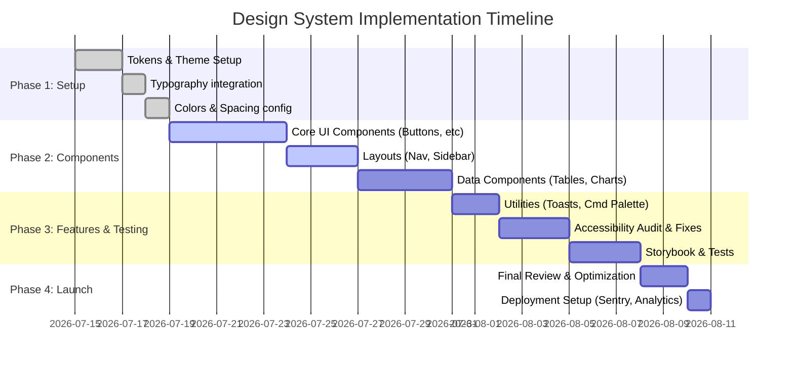

# Executive Summary

We propose a **ChatGPT-inspired light theme design system** for the Vertex HRMS. This system prioritizes **clarity, consistency, and polished micro-interactions**, borrowing from ChatGPT’s minimalist UI and modern SaaS standards. It features a tight **8px spacing scale**, a **neutral color palette with one brand accent**, and a refined **typography scale**. Components (buttons, inputs, cards, etc.) follow consistent states (hover, focus, disabled) with subtle **motion** (150–250ms ease-out transitions) for perceived performance. Accessibility (WCAG contrast, keyboard, ARIA) and production concerns (font loading, caching, Sentry, analytics) are addressed. This document covers design principles, tokens (colors, fonts, spacing, radii, shadows), component specs with code examples (Tailwind+shadcn/radix+Framer Motion), checklists, and rollout timeline. Key sources include OpenAI’s ChatGPT UI guidelines and industry design systems (Atlassian).

# Design Principles

- **Minimal & Neutral**: White/off-white backgrounds, light borders. Keep clutter low; use whitespace to guide attention.  
- **Consistent Hierarchy**: Limit typefaces/weights; use clear heading/body differentiation.  
- **Subtle Branding**: One primary accent (brand green) for buttons/badges, not on large backgrounds. No heavy gradients or saturated fills.  
- **8px Grid**: Use an 8px base unit for all spacing. Align to a grid for visual harmony.  
- **Moderate Rounding**: Standardize border-radius (4–12px). Focus rings = base radius + 2px.  
- **Soft Motion**: Short, purposeful animations for state changes. Follow durations ≈50–150ms for hovers, 150–250ms for modals/menus. Easing `cubic-bezier(0,0.4,0,1)` (ease-out) or gentle curves.  
- **Accessibility First**: Maintain ≥4.5:1 contrast for text, include keyboard focus styles, use semantic HTML/ARIA.  

# Typography

## Font Stack

```
font-family: 'Geist', -apple-system, BlinkMacSystemFont, 'Segoe UI', Roboto, sans-serif;
```

**Rendering optimizations** (always applied on `body`):
```css
-webkit-font-smoothing: antialiased;
-moz-osx-font-smoothing: grayscale;
text-rendering: optimizeLegibility;
```

> **CRITICAL**: Do NOT set `html { font-size: <anything other than 100%> }`. Fractional root sizes (e.g. 90%) cause blurry text on 1x DPI displays.

## The 6-Level Type Scale

Use **ONLY** these 6 tokens. No arbitrary `text-[Npx]` or `font-[N]` values.

| Token Class | Size | Weight | Line-Height | Letter-Spacing | Use Case |
|---|---|---|---|---|---|
| `type-h1` | 24px | 600 (semibold) | 30px | -0.02em | Page titles |
| `type-h2` | 18px | 600 (semibold) | 24px | -0.015em | Section headings, card titles |
| `type-body` | 15px | 400 (regular) | 22px | 0em | Default text, paragraphs |
| `type-body-medium` | 15px | 500 (medium) | 22px | 0em | Nav items, labels, emphasized text |
| `type-small` | 13px | 400 (regular) | 18px | 0.01em | Captions, metadata, secondary info |
| `type-caption` | 11px | 500 (medium) | 16px | 0.02em | Badges, tags, tiny labels |

## Weight Rules (3 weights ONLY)

- **400 (Regular)**: Body text, descriptions, secondary text. Use `font-normal`.
- **500 (Medium)**: Labels, nav items, form labels, emphasized text. Use `font-medium`.
- **600 (Semibold)**: Headings (h1, h2), buttons, important actions. Use `font-semibold`.

> **BANNED**: `font-bold` (700), `font-extrabold` (800), `font-[450]`, `font-[510]`, `font-[550]`, or any arbitrary `font-[N]` value. These create inconsistent stroke widths on low-DPI displays.

## Component-to-Token Mapping

| Component | Token | Notes |
|---|---|---|
| Page title ("Attendance", "Home") | `type-h1` | Always `text-[#161616]` |
| Page subtitle | `type-body text-[#737373]` | Below page title |
| Card heading | `type-h2` | Inside card/panel |
| Department dropdown label | `type-h2` | Bold department name |
| Body/paragraph text | `type-body` | Default for all text |
| Nav items, form labels | `type-body-medium` | Slightly emphasized |
| Search input text | `type-small` | Inside input fields |
| Calendar day labels | `type-small` | Mon, Tue, Wed... |
| Calendar day numbers | `type-small` | Individual date cells |
| Calendar month title | `type-body-medium` | "July 2026" header |
| Stat badges (Present, Absent) | `type-caption` | Inside colored badges |
| Stat badge numbers | `type-small font-semibold` | The count numbers |
| Button text | `type-body-medium` or `type-small` | Depending on button size |
| Dropdown option text | `type-body` | Inside dropdown menus |
| Input placeholder | `type-small text-[#8B8B8B]` | Muted placeholder |

## Enforcement Rules

1. **Never use arbitrary pixel sizes**: No `text-[11px]`, `text-[14px]`, `text-[22px]`, etc. Always pick the nearest type token.
2. **Never use arbitrary font weights**: No `font-[450]`, `font-[510]`. Use only `font-normal`, `font-medium`, `font-semibold`.
3. **Use the utility classes**: Apply `type-h1`, `type-body`, etc. directly. Override only `color` and `text-align` as needed.
4. **One heading per section**: Every page has one `type-h1`. Sub-sections use `type-h2`.
5. **Consistency over creativity**: If unsure, use `type-body`. It is the safe default.  

# Color System

- **Neutral Palette** (light mode):  
  - `background: #FAFAF9` (very light gray),  
  - `surface/card: #FFFFFF`,  
  - `border: #ECECEC`,  
  - `text.primary: #161616`,  
  - `text.secondary: #616161`,  
  - `muted: #8B8B8B`.  
- **Accent**: Black (e.g. `#161616` or `#000000`) for primary buttons and focus states. Brand Green (`#16A34A`) is reserved for positive semantic status indicators (success, active) rather than primary actions.  
- **Semantic Colors**: Status colors (info, success, warning, error): e.g. blue (#3B82F6), green (#16A34A), yellow (#FBBF24), red (#DC2626). Only use on icons or badges, not as page background.  
- **Tokens & Tailwind Config**: Define CSS variables or Tailwind `theme.colors` keys: e.g. `background`, `surface`, `border`, `text`, `muted`, plus semantic: `success`, `danger`, etc. Avoid modifying core neutral grays. Tailwind example:  
  ```js
  // tailwind.config.js
  theme: {
    extend: {
      colors: {
        background: '#FAFAF9',
        surface: '#FFFFFF',
        border: '#ECECEC',
        text: {
          DEFAULT: '#161616',
          secondary: '#616161',
          muted: '#8B8B8B'
        },
        primary: {
          500: '#16A34A'
        },
        success: '#16A34A',
        warning: '#FBBF24',
        danger: '#DC2626'
      }
    }
  }
  ```.  
- **Contrast**: Verify all text meets WCAG AA (≥4.5:1). For example, ensure `#161616` on white passes. Avoid low-contrast grays on white.  

# Spacing System

- **8px Grid**: Base unit = 8px. All margin/padding multiples of 8 (or 4 for very small gaps).  
- **Spacing Tokens** (like Atlassian): `0, 2, 4, 6, 8, 12, 16, 20, 24, 32, 40, 48, 64`px corresponding to tokens `space.0` through `space.1000`. E.g. `space-100: 8px`, `space-200: 16px`.  
- **Containers**: Base designs on a 1440px-wide canvas (the most common business laptop size) with horizontal padding (`px-4`, `lg:px-8`). Center content using `max-w-[1440px] mx-auto`. Scale up for 4K rather than scaling down from 1920px.  
- **Layout**: Vertical rhythm: use 24px (3 × 8) for section gaps, 16px for smaller between items.  
- **Tailwind**: Use `space-x-`, `space-y-`, `p-`, `m-` utilities in multiples of 2 (`.5rem = 8px`, `1rem = 16px`, etc). Example: `<div class="p-4 lg:p-8">`.  
- **Design Tokens JSON** (example):
  ```json
  {
    "space": {
      "0": "0px",
      "0.25": "2px",
      "0.5": "4px",
      "0.75": "6px",
      "1": "8px",
      "1.5": "12px",
      "2": "16px",
      "2.5": "20px",
      "3": "24px",
      "4": "32px",
      "5": "40px",
      "6": "48px",
      "8": "64px",
      "10": "80px"
    }
  }
  ```.

# Radii & Elevation

- **Corner Radii**: Use a consistent set (4px, 8px, 12px, 16px): e.g. small controls (4px), buttons/inputs (8px), cards/modals (12px). Atlassian tokens: `xsmall 2px`, `small 4px`, `medium 6px`, `large 8px`, `xlarge 12px`. We suggest rounding around 6–12px for a modern look.  
- **Focus Ring**: Outline thickness 2px, matching component radius +2px. E.g. button `rounded-md` (8px) gets focus outline radius 10px.  
- **Shadows (Elevation)**: Cards and table panels do not use shadows (they are completely flat with a light border) to maintain a clean, minimalist, and modern appearance. Example RGBA shadows:
  - **Tier 0 (flat)**: `none` (cards/panels are white with border)  
  - **Tier 1 (float)**: `none` (no float shadow for standard cards)  
  - **Tier 2 (deep)**: `0 4px 12px rgba(0,0,0,0.08)` for overlays, dropdowns, and modals.  
  - **Backdrop**: For modals, `rgba(0,0,0,0.3)` semi-transparent overlay.  
  Feel free to mimic Atlassian’s scheme for overlays, but ChatGPT style is mostly flat.  
- **Tailwind**: `theme.boxShadow` for cards should be `none`. dropdowns/modals can use `shadow-md`.  

# Iconography

- **Library**: Continue using [Lucide](https://lucide.dev) or Radix icons. Ensure consistent style (stroke width, rounded vs sharp ends). For ChatGPT style, thin, minimal icons (like Lucide’s default stroke 1.5px) fit well.  
- **Sizes**: Use consistent icon sizes:
  - **Default**: 16×16 or 18×18px for most UI (buttons, inputs).  
  - **Small**: 12×12px only in tight places (status badges, validation icons).  
  - **Large**: 20×20 or 24×24px for charts, headings, big actions.  
  Example table:

  | Usage            | Size  | Tailwind |
  |------------------|-------|----------|
  | Sidebar icons    | 18px  | `h-4 w-4`|
  | Button icons     | 16px  | `h-4 w-4`|
  | Badge/status     | 12px  | `h-3 w-3`|
  | Large displays   | 20-24px| `h-5 w-5` or `h-6 w-6` |

  (Adapt *Lucide* props or `className` accordingly).  

- **Color**: Icons use `currentColor` so can inherit `text-*`. For disabled/inactive, use lower-contrast color (e.g. `text-muted`). Ensure icons meet contrast ratios against their background.  
- **Usage**: Always pair icon with text or tooltip for clarity. Avoid icons as the sole indicator unless universally recognized.

# Motion

- **Durations**:  
  - Micro-interactions (hover, press): ~**50–150ms**. E.g. button hover 100ms.  
  - Component transitions (menus, modals, accordions): ~**150–250ms**. E.g. dropdown open 150ms, modal fade 250ms.  
- **Easing**: Soft curves. For example, `ease-out` (`cubic-bezier(0,0.4,0,1)`) for entry, `ease-in-out` for toggles.  
- **Properties**: Use opacity/transform/scale. E.g. fade in/out modals (opacity + scale), slide panels (translateY).  
- **Implementation**: Use Framer Motion for React or CSS transitions:
  ```jsx
  <motion.div 
    initial={{ opacity: 0, scale: 0.95 }} 
    animate={{ opacity: 1, scale: 1 }} 
    exit={{ opacity: 0, scale: 0.95 }}
    transition={{ duration: 0.2, ease: [0,0.4,0,1] }}
  > 
    <!-- Content --> 
  </motion.div>
  ```
  Follow preference for reduced-motion (Honor `prefers-reduced-motion`).  
- **Keyboard focus**: No animation on focus to avoid distraction.  

# Components

Below are core components styled in Tailwind (with shadcn/Radix where applicable) and Framer Motion for motion. Use `cmdk` or Headless UI for command palette.

## Buttons

- **Variants**: 
  - **Primary** (filled): `bg-black text-white hover:bg-neutral-800`, `rounded-md`, height ~42px, font `text-[15px] font-semibold`.
  - **Secondary** (outline): `border border-gray-300 text-black bg-white`, hover `bg-gray-50`.
  - **Disabled**: `opacity-50 cursor-not-allowed`.
- **Example**:
  ```jsx
  <button className="h-10 px-4 bg-black hover:bg-neutral-800 text-white font-semibold rounded-md transition">
    Submit
  </button>
  ```
  *(Tailwind uses `hover:`; Radix `asChild` if needed)*.  
- **States**: Hover, active, focus (outline ring: `focus:ring-2 focus:ring-neutral-200`), disabled. Ensure focus ring is `offset(2px)`, matching radius.  

## Inputs & Forms

- **Height**: ~44px, `rounded-sm` or `rounded-md` (4–6px) depending on style.  
- **Border**: `border-2 border-gray-200`, `focus:border-primary-500 focus:ring-2 focus:ring-primary-200`.  
- **Padding**: `px-3 py-2`.  
- **Disabled**: gray background (`bg-gray-100`), no pointer.  
- **Validation**: Show icon/text in red, border red if error, green if success. e.g. `<Input.Root>` from Radix with `aria-invalid`.  
- **Example**:
  ```jsx
  <label className="block text-sm font-medium text-gray-700">Email</label>
  <input type="email" className="mt-1 block w-full px-3 py-2 bg-white border border-gray-300 rounded-md shadow-sm focus:outline-none focus:ring-2 focus:ring-primary-500" />
  ```
- **Accessibility**: Associate `<label>` with input, use `aria-invalid` for errors.

## Cards & Panels

- **Background**: always white (#fff).  
- **Border**: 1px gray border (`border border-gray-200`).  
- **Radius**: 8px (`rounded-lg`).  
- **Shadow**: No shadow. Flat border layout.  
- **Padding**: consistent, e.g. `p-4` for normal, `p-6` for larger panels.  
- **Use**: Group info (lists, charts, stats). Title (h3) + content.  
- **Example**:
  ```html
  <div class="bg-white border border-gray-200 rounded-lg p-6">
    <h3 class="text-lg font-semibold mb-2">Employee Stats</h3>
    <!-- content -->
  </div>
  ```

## Sidebar (Navigation)

- **Width**: ~280px fixed.  
- **Background**: light gray (#F7F7F5 or #FAFAF9).  
- **Items**: use `list-none` with spacing `gap-3`.  
- **Active item**: bold text, primary icon color, or a left border.  
- **Hover**: `bg-gray-100 rounded-l-md`.  
- **Example**:
  ```jsx
  <nav className="w-72 bg-[#F7F7F5] border-r border-gray-200">
    <ul className="space-y-2 p-4">
      <li><a href="#" className="flex items-center p-2 rounded-md hover:bg-gray-100"><HomeIcon className="h-5 w-5 mr-3"/> Home</a></li>
      <!-- more -->
    </ul>
  </nav>
  ```

## Tables

- **Striped rows**: alternating `bg-white` and `bg-gray-50` on hover.  
- **Borders**: light `border-b` on rows, `border-gray-200` on header.  
- **Padding**: `py-3 px-4` cells.  
- **Font**: header `text-sm font-medium uppercase`, body `text-sm`.  
- **Scrolling**: fixed header, body scroll. Use TanStack Table for large data (100k rows). Use virtualization (React Virtual) for performance.  
- **Example**:
  ```html
  <table class="min-w-full divide-y divide-gray-200">
    <thead class="bg-gray-50">
      <tr><th class="px-4 py-2 text-left text-xs font-medium text-gray-500 uppercase">Name</th> <!-- ... --> </tr>
    </thead>
    <tbody class="bg-white divide-y divide-gray-200">
      <!-- Rows -->
    </tbody>
  </table>
  ```

## Modals / Dialogs

- **Backdrop**: `bg-black bg-opacity-30 fixed inset-0`.  
- **Container**: `bg-white rounded-xl p-6 shadow-lg max-w-lg mx-auto my-24` (centered).  
- **Transition**: fade+scale (using Framer Motion).  
- **Close**: close `X` at top right, focusable.  
- **Example (shadcn)**:
  ```jsx
  <DialogOverlay className="fixed inset-0 bg-black opacity-30" />
  <DialogContent className="bg-white rounded-xl p-6 shadow-lg max-w-xl mx-auto my-24">
    <DialogTitle className="text-xl font-semibold">Settings</DialogTitle>
    <!-- ... -->
  </DialogContent>
  ```
  Use Radix’s `Dialog` or shadcn’s wrapper for ARIA.

## Toasts / Notifications

- **Library**: Use [Sonner](https://sonner.vercel.app/) for production-quality toasts.  
- **Style**: `bg-gray-800 text-white` or white with accent icon.  
- **Animation**: slide/fade in (100ms), out (150ms).  
- **Placement**: top-right (desktop).  
- **Example**:
  ```jsx
  import { toast } from 'sonner';
  toast.success('Saved!', { duration: 2000 });
  ```

## Command Palette

- **Trigger**: global `⌘K/Ctrl+K`.  
- **Layout**: Centered overlay, `max-w-md bg-white rounded-lg border border-gray-200 shadow-md` with input and results list.  
- **Interaction**: filter items, arrow navigation, select to navigate. Use [cmdk](https://github.com/csandman/cmdk) or create custom with Framer Motion.  
- **Example** (outline):
  ```jsx
  <Cmdk.CommandDialog open={isOpen} onOpenChange={setIsOpen}>
    <Cmdk.CommandInput placeholder="Type a command or search..." />
    <Cmdk.CommandList>
      <Cmdk.CommandGroup heading="Search">
        <Cmdk.CommandItem>Employee: John Doe</Cmdk.CommandItem>
        <!-- more -->
      </Cmdk.CommandGroup>
    </Cmdk.CommandList>
  </Cmdk.CommandDialog>
  ```
- **Styling**: Input height 44px, border, rounded. Items `hover:bg-gray-50`.

# Accessibility Checklist

- **Contrast**: >=4.5:1 text; >=3:1 large text. Test via a11y tools.  
- **Keyboard**: Ensure all interactive components (buttons, links, inputs, modals) are focusable (`tabindex=0`/native). Visible focus ring on focus (no “outline: none” without replacement).  
- **ARIA Roles**: Use appropriate roles (e.g., `role="dialog"` for modals, `aria-expanded`, `aria-labels`). Radix components handle ARIA where possible.  
- **Labels**: All form controls have `<label>` or `aria-label`.  
- **Reduced Motion**: Respect `prefers-reduced-motion` – reduce or remove non-essential animations.  
- **Text Size**: Provide responsive text; allow zoom scaling. Avoid setting `line-height` less than 1.2.  
- **Semantic HTML**: Use `<table>`, `<nav>`, `<main>`, etc. to improve screen reader structure.  
- **Tests**: Run axe or Lighthouse a11y audits.  

# Performance & Production

- **Font Loading**: Use variable fonts (Inter, Geist) to reduce weight. Use `font-display: swap`. Self-host fonts or use system fonts to improve FCP.  
- **Critical CSS**: Purge unused Tailwind classes. Preload key assets (fonts, hero images). Use Vercel’s analytics & SVP (speed-insights) for monitoring.  
- **Caching**: SSG/SSR where possible. Use SWR/React Query for data fetching caching and offline (with Supabase + Next.js).  
- **Observability**: Integrate Sentry for error logging, PostHog for product analytics to track feature usage. Use console logging lib (Pino) on server.  
- **Security**: Use `Content-Security-Policy`, sanitize user input, enable HTTPS, use Supabase Row-level Security.  
- **Production Build**: Enable React profiling in prod build if needed. Use Next.js optimizations: images, SSR caching, etc.  
- **Dev Tools**: Setup Git hooks (Prettier, ESLint, lint-staged) to enforce code style.  

# Testing & Documentation

- **Unit Tests**: Use **Vitest** for component logic.  
- **Integration/E2E**: Use **Playwright** for critical flows (login, CRUD operations).  
- **Visual Regression**: Use Chromatic or Percy on Storybook to catch UI breaks.  
- **Mocking**: Use **MSW** to mock API in tests, **Testing Library** for UI interactions.  
- **Storybook**: Document all components and states. Each variant (primary, disabled, hover) visible. Use SvelteKit or Next integration.  
- **Style Guide**: Generate design tokens JSON (see example below). Maintain a living style guide (Figma and code).  

# Implementation Checklist & Migration

Prioritize and estimate:

1. **Define Tokens & Theme (2d)**  
   - Audit current CSS/styles. Decide base tokens (colors, fonts, spacing, radii) and update Tailwind config.  
2. **Typography & Fonts (1d)**  
   - Integrate chosen fonts (Inter/Geist variables). Define CSS variables for type scale.  
3. **Color & Spacing Setup (2d)**  
   - Add CSS variables/ Tailwind for colors and spacing tokenization. Remove hard-coded values.  
4. **Core Components (5d)**  
   - Refactor Buttons, Inputs, Cards with new classes/token values. Use shadcn/Radix for accessible base.  
   - Implement motion (Framer) in navigation, modals.  
5. **Layouts & Navigation (3d)**  
   - Rebuild Sidebar, Header, Dashboard using new system. Ensure responsiveness.  
6. **Data Components (4d)**  
   - Tables (with TanStack Table), charts (Recharts or Visx). Add virtualization.  
7. **Utilities & Features (2d)**  
   - Add Toast (Sonner), Command Palette (Cmdk), QR code (react-qr-code) usage examples.  
8. **Accessibility & Tests (3d)**  
   - Audit with tools, fix issues. Write tests (Vitest/Playwright) for key flows.  
9. **Documentation (3d)**  
   - Write Storybook stories, update README & docs. Provide tailwind config snippet and token JSON.  
10. **Review & Polish (2d)**  
   - Fine-tune spacing and typography. Gather feedback, fix bugs.  
11. **Deployment (1d)**  
   - Configure Sentry, PostHog, analytics. Final performance audit.  

_Total ~ 25 days (estimated)._  

**Mermaid: Component Relationships**  
```mermaid
flowchart TD
  A[Tailwind Theme Tokens] --> B[Colors, Spacing, Fonts, Radii]
  B --> C[Button Component]
  B --> D[Input Component]
  B --> E[Card Component]
  C -->|uses| F[Radix Button Primitive]
  D -->|uses| G[Radix Input Primitive]
  E -->|uses| H[Radix Card/Popover]
  C --> I[Framer Motion]
  D --> I
  E --> I
  B --> J[Command Palette (cmdk)]
  K[Pages (React/Next.js)] -->|imports| C
  K -->|imports| D
  K -->|imports| E
  K -->|fetches| L[Supabase API]
```

**Mermaid: Timeline Flowchart**  


# Example Config & Tokens

**Tailwind Config (excerpt)**:
```js
// tailwind.config.js
module.exports = {
  theme: {
    extend: {
      colors: {
        background: '#FAFAF9',
        surface: '#FFFFFF',
        border: '#ECECEC',
        text: {
          DEFAULT: '#161616',
          secondary: '#616161',
          muted: '#8B8B8B'
        },
        primary: '#161616',
        success: '#16A34A',
        warning: '#FBBF24',
        danger: '#DC2626'
      },
      spacing: {
        '0.5': '4px',   // space-50
        '1': '8px',
        '1.5': '12px',
        '2': '16px',
        '2.5': '20px',
        '3': '24px',
        '4': '32px'
      },
      borderRadius: {
        sm: '4px',
        md: '8px',
        lg: '12px',
        xl: '16px'
      },
      boxShadow: {
        light: '0 1px 2px rgba(0,0,0,0.04)',
        md:   '0 4px 12px rgba(0,0,0,0.08)'
      }
    }
  }
}
```

**Design Tokens (JSON) Sample**:
```json
{
  "color": {
    "background": "#FAFAF9",
    "surface": "#FFFFFF",
    "border": "#ECECEC",
    "textPrimary": "#161616",
    "textSecondary": "#616161",
    "primary": "#16A34A",
    "success": "#16A34A",
    "warning": "#FBBF24",
    "danger": "#DC2626"
  },
  "font": {
    "base": "Inter, sans-serif",
    "heading": "Geist Variable, sans-serif",
    "mono": "Geist Mono, monospace"
  },
  "fontSize": {
    "display": 44,
    "h1": 32,
    "h2": 26,
    "h3": 22,
    "bodyL": 17,
    "body": 15,
    "small": 13,
    "caption": 12
  },
  "spacing": {
    "0": 0,
    "0.5": 4,
    "1": 8,
    "1.5": 12,
    "2": 16,
    "2.5": 20,
    "3": 24,
    "4": 32
  },
  "radius": {
    "sm": 4,
    "md": 8,
    "lg": 12,
    "xl": 16,
    "full": 999
  },
  "shadow": {
    "light": "0 1px 2px rgba(0,0,0,0.04)",
    "md": "0 4px 12px rgba(0,0,0,0.08)"
  }
}
```

_Design tokens and Tailwind config should be revised to match your actual brand (exact green hex, font licensing)._  

**Sources:** OpenAI ChatGPT UI guidelines; Atlassian Design System (spacing, icons, motion); WCAG contrast rules; Tailwind docs.